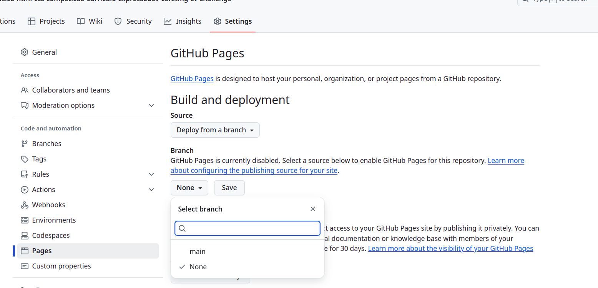

[](https://classroom.github.com/a/uqiYKns0)
# Página Crie o seu Currículo (ou fictício)

Crie uma página Web para apresentar um currículo vitae, seja seu ou de um personagem fictício! Você pode criar o seu próprio currículo, o de outra pessoa ou até de um personagem inventado — use a criatividade!

**Atenção**: Como o site estará publico, não recomendamos informar endereço ou alguma informação sensível.

## Competição - Como irá funcionar?

A competição será avaliada por dois critérios:

1. **Análise técnica**: O professor, juntamente com os monitores, avaliarão aspectos tais como código limpo, usabilidade, responsividade e criatividade no design.  
2. **Votação popular**: As páginas serão publicadas online para que o público vote na sua favorita.

A nota final de cada estudante será calculada combinando **Análise Técnica** e **Votação Popular**. A análise técnica será uma nota de 0 a 10 e a votação popular será normalizada. Logo após, será realizado uma média ponderada das notas. Assim, a nota final do aluno será calculada a fórmula abaixo:  

1. **Normalização da votação popular** (transformando em uma escala de 0 a 10):  ```Voto_Normalizado = (Votos_Recebidos / Votos_Máximos) * 10```. Sendo que ```Votos_Máximos``` é o número de votos do aluno mais bem votado em sua chave.
2. **Cálculo da nota final**: ```Nota_Final = (Análise_Técnica * 0.6) + (Voto_Normalizado * 0.4)```

Tanto alunos dos módulos básicos e avançados poderão participar! Serão selecionados as 8 melhores páginas e a competição terá duas etapas: 

1. **Etapa classificatória**: iremos classificar até 8 páginas sendo até 3 páginas de alunos do módulo básico. Os estudantes serão divididos em chaves de maneira aleatória e serão selecionados os melhores de cada uma. Em cada chave, pelo menos o último colocado será desclassificado. A quantidade de chaves e alunos classificados serão definidos após a submissão das tarefas, considerando a quantidade de concorrentes.
2. **Etapa final**: as páginas classificadas realizarão sua última disputa para definir a colocação final na competição.


---
## Dados do competidor
Iremos divulgar sua página nas mídias sociais, caso autorize a divulgação das suas redes sociais junto com o site, edite este README.MD e informe os seguintes dados:

- Conta do Instagram:
- Conta do LinkedIn:

Esses dados não são obrigatórios. 

---
## Avaliação técnica - critérios

Para ganhar 100% na avaliação técnica o código deve conter:

- **Ícone da página** (favicon).  
- **Uso de Flexbox ou CSS Grid** para organizar o layout.  
- **Animação CSS** (pode ser um efeito sutil para deixar a página mais dinâmica).
- **Paleta de cores do CV, com uso de custom properties** 
- **Código limpo e boas práticas**, código sem repetições desnecessárias e considerando as [boas práticas discutidas no curso](https://prof-hasan.github.io/guias-curso-extensao/boas_praticas_html_css.pdf).
- **Código responsivo**
- **Design agradável e atualizado** (evitando o visual dos anos 90, conforme explicado abaixo)

<details>
   <summary>Evite a "carinha dos anos 90" 😆</summary>
   <p>Nada contra os anos 90, na verdade, amo essa década! Mas, nos primórdios da Web, os designs eram bem ruins:</p>
   <p>
      
      
      
      
      
      
   </p>
   <p>O que era comum naquela época, mas evitamos hoje?</p>
   <ul>
      <li>Usar cores demais.</li>
      <li>Usar imagens de fundo indiscriminadamente (hoje usamos com parcimônia e sem repetição).</li>
      <li>Usar apenas fontes padrão (ex: Arial, Times New Roman).</li>
      <li>Hiperlinks sublinhados com azul ou roxo. Hoje, o sublinhado pode ser estilizado apenas em <code>:hover</code>.</li>
      <li>Degradês muito extravagantes.</li>
      <li>Layouts simples de uma única coluna.</li>
      <li>Falta de separação visual entre seções (cabeçalho, conteúdo, rodapé).</li>
      <li>Bordas muito grossas. Hoje, geralmente usamos no máximo 1-2px.</li>
      <li>Arredondamento excessivo de bordas. Se arredondar, que seja sutil (5-10px).</li>
      <li>Falta de imagens. Hoje elas são essenciais para compor o design.</li>
      <li>Falta de espaçamento adequado. É importante planejar os espaços vazios para evitar elementos "grudados".</li>
   </ul>
   <p>Exemplos de bons designs hoje em dia:</p>
   <ul>
      <li><a href="https://www.batokasafaris.com/">Batoka Safaris</a></li>
      <li><a href="https://wovenmagazine.com/">Revista Woven</a></li>
      <li><a href="https://alistapart.com/">A List Apart</a></li>
      <li><a href="https://www.artstation.com/">ArtStation</a></li>
      <li><a href="https://www.nowness.com/">Loja Nowness</a></li>
      <li><a href="https://store.steampowered.com/">Steam</a></li>
   </ul>
</details>

Quer outro exemplo de site dos anos 90? O [Internet Archive](https://web.archive.org/) guarda versões antigas de várias páginas da Web.  
Veja o [site do CEFET-MG em 2001](https://web.archive.org/web/20010119180700/http://www.cefetmg.br/) e entenda o que é um "site com cara dos anos 90". 😆

---
## Regras de Conduta e Motivos para Eliminação
Para garantir um ambiente respeitoso e justo para todos os participantes, qualquer página submetida à competição **será automaticamente eliminada caso contenha**:

1. **Discriminação ou Ofensa**: Qualquer tipo de conteúdo que promova preconceito, discurso de ódio, assédio, intimidação ou ataques a indivíduos ou grupos com base em raça, etnia, gênero, orientação sexual, religião, deficiência ou qualquer outra característica.

2. **Conteúdo Abusivo**: Material que incite violência, difame, exponha de forma indevida terceiros, contenha linguagem imprópria ou viole normas éticas.

3. **Violação de Direitos Autorais**: Uso de textos, imagens, vídeos, músicas ou qualquer outro conteúdo protegido sem a devida autorização ou crédito apropriado. É responsabilidade do participante garantir que todo o material utilizado esteja de acordo com as normas de propriedade intelectual.

4. **Baixa qualidade do currículo**: Caso a página receba menos que 40% dos pontos na avaliação técnica ela será eleminada

**Dica**: Se for utilizar imagens, fontes ou outros recursos externos, opte por conteúdos de domínio público ou com licenças abertas, como [Creative Commons](https://pt.wikipedia.org/wiki/Creative_Commons).

**🔍 Fiscalização**: A organização reserva-se o direito de revisar todas as submissões e remover qualquer página que viole estas diretrizes, sem aviso prévio.

---
## Reconhecimentos e prêmios

🏆 **Os 8 primeiros colocados recebem certificado de destaque.**  

🎖️ **Hall da Fama**: as páginas finalistas ficarão em destaque no site do curso, [similar a este](https://prof-hasan.github.io/cefet-front-end-extensao/#tps), por um tempo proporcional à colocação:  

- 🥇 **1º e 2º lugares** → 2 anos  
- 🥈 **3º e 4º lugares** → 1 ano  
- 🥉 **5º a 8º lugares** → 3 meses  

Atenção que apenas as páginas finalistas entrarão para o Hall da fama. Caso sejam classificadas 6 páginas, apenas essas páginas estarão no Hall da Fama.

✨ **Prêmio especial para o 1º lugar:**  
- **4 horas de mentoria individualizada** realizada pelo prof. Daniel Hasan em um dos seguintes temas:  
  - Aprendizado de Máquina  
  - Desenvolvimento Web (HTML/CSS/JS ou Django/Python)  
- **Direito a certificado de mentoria**  
Boa sorte e capriche no design do seu currículo! 🚀  
---
## Visualização via GithubPages
A página criada deverá ser visualizada automaticamente via [GithubPages](https://pages.github.com/). 

Para isso, você deverá ir em configurações (settings) do repositório, acesse o item `Páginas` (Pages) e, logo após, selecione a branch principal: 

Logo após, e depois de alguns minutos de enviar seu código, você poderá digitar a seguinte URL: `<usuario>.github.io/<nome-do-repositorio>` e conseguirá acessá-la.
